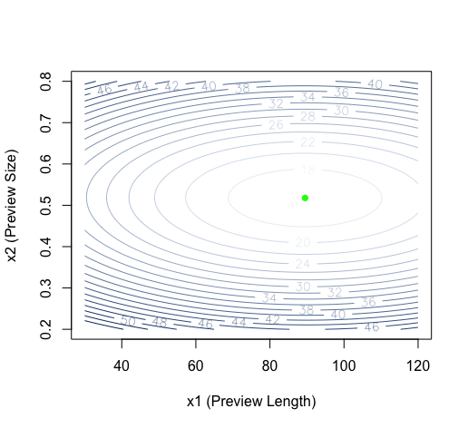
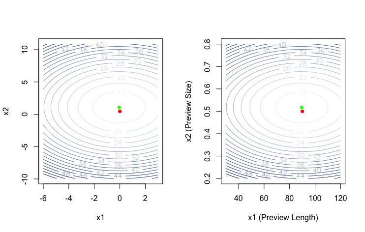

# Netflix Experimental Design

* Summary and Results
* Phase 1 - Factor Screening
* Phase 2 - Path of Steepest Descent
* Phase 3 - Response Surface Methodology

## Summary and Results

This project is on experimenting with different features of the online streaming service to reduce the average browsing time. Netflix users often experience choice overload and can be overcome by a psychological phenomenon known as **decision paralysis**. This makes it harder for them to make a decision when faced with a large number of options which often results in them losing interest and not watching anything. To overcome this, Netflix tries to create an interface that will reduce the browsing time and will ensure the user does not leave the site disappointed. This project aims to determine the combined optimum value of three features namely Tile Size, Preview Length and Preview Size that result in the lowest average browsing time. 

The optimum value turns out to be 

| Average Browsing Time | Preview Length | Preview Size | Tile Size |
| ------------- | ------------- | ------------- | ------------- |
| 16 minutes 59 seconds | 90  | 0.5 | 0.2 |

## Phase 1 - Factor Screening

The objective of this phase is to determine whether all 3 factors i.e Tile Size, Preview Size and Preview Length are important in reducing the *Average Browsing Time* of the user. If a factor does not significantly reduce the browsing time, it can be removed from further analysis. A 2^3 factorial experiment was conducted for this purpose with the null hypothesis being that the factor does not have an effect on the response variable. 

After running a linear regression model, we conclude that Tile Size does not play a major role in reducing the browsing time. Hypothesis testing resulted in a **pvalue of 0.7605** which means the null hypothesis cannot be rejected. The plots below show the effect of each factor on the response variable.

As a result, we will drop Tile Size for the rest of the experiment.

## Phase 2 - Path of Steepest Descent

This objective of this phase is to determine whether we are in the vicinity of the optimum by checking if the calculated values fall in the presence of quadratic curvature. If not, we would have to move towards that curvature in order to get closer to our optimum. For this, the best way is to start with a center point and move towards the optimum. 

After fitting a second order model and running another hypothesis test, we concluded that the **pvalue of 0.97** suggests that we are not in the vicinity of the optimum and so must apply the method of steepest descent. In our case, the center point is at a Preview Length of 60 and we take increments of 10. It is important to choose a step size which is neither too small as it would require more experimental values, nor too big that it moves away from the optimum too quick. We need to narrow down our search to points that are in the vicinity of the optimum. 

The image below shows the 2D contour plot of steps taken

 

The graph shows us the plot of steps taken and we can see that the optimum lies somewhere between steps 2 and 4 as that is where we reached the lowest browsing time

 

Taking the new high and low points we run another regression to check if we are in the presence of the quadratic curve and the **pvalue of 0.00012** rejects the null hypothesis and confirms that we are infact in the vicinity of the optimum. We can now  fit a second order model and use Response Surface Methodology to find the optimum point.

## Phase 3 - Response Surface Methodology

The objective of this phase is to find the optimum value that gives the lowest average browsing time. To determine that value, we use the spherical central composite design with parameter a = sqrt(2). Recentering the data and running a regression will confirm if the second order model is in the vicinity of the optimum. 

From our calculations, the predicted average browsing rate is 16.59 with a 95% prediction interval of (16.39,16.79). This can be achieved by a Preview Length of 89.49 and Preview Size of 0.517. A slightly less but more practical measurement would be 

| Preview Length | Preview Size |
| ------------- | ------------- |
| 90 | 0.5 |

The green points on the plots show the optimum value and the red plots show the slightly less optimum values

