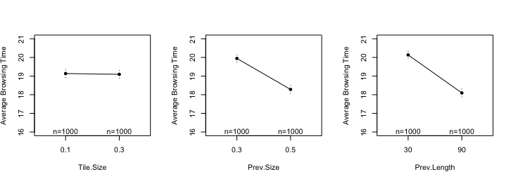

# Netflix Experimental Design

* Summary and Results
* Phase 1 - Factor Screening
* Phase 2 - Path of Steepest Descent
* Phase 3 - Response Surface Methodology

## Summary and Results

This project is on experimenting with different features of the online streaming service to reduce the average browsing time. Netflix users often experience choice overload and can be overcome by a psychological phenomenon known as **decision paralysis**. This makes it harder for them to make a decision when faced with a large number of options which often results in them losing interest and not watching anything. To overcome this, Netflix tries to create an interface that will reduce the browsing time and will ensure the user does not leave the site disappointed. This project aims to determine the combined optimum value of three features namely Tile Size, Preview Length and Preview Size that result in the lowest average browsing time. 

The optimum value turns out to be 

| Average Browsing Time | Preview Length | Preview Size | Tile Size |
| ------------- | ------------- | ------------- | ------------- |
| 16 minutes  | 90  | 0.5 | 0.2 |

## Phase 1 - Factor Screening

The objective of this phase is to determine whether all 3 factors i.e Tile Size, Preview Size and Preview Length are important in reducing the *Average Browsing Time* of the user. If there is any factor not significant to the response variable it can be removed from further analysis. 

After running a linear regression model, we observed that Tile Size did not have an effect on our response variable which can be seen in the factor screening plots below. Therefore, we can omit that factor and only use Preview Size and Length to reach the optimum value.

## Phase 2 - Gradient Descent

This phase determines if we are currently in the presence of quadratic curvature. If not, we would have to move towards that curvature in order to get closer to our optimum. For this we would start at our centre and take steps until we find the turning point. This would be the point at which our response variable starts to increase again indicating we were at the optimum point and have moved away.

In this case, the center point was at a Preview Length of 60 and we took increments of 10. It is important to be careful of the step size as very small steps would require more data and hence more resources but large sizes might cause us to move away from the optimum too quick

 

The image below shows us the plot of steps taken and we can see that the optimum lies somewhere between steps 2 and 4

 

Taking the new high and low points we generate data and check if we are now in the quadratic curvature through linear regression. Our results give a pvalue less than the 5% significance level therefore we reject the null hypothesis and state that we are now in the presence of the quadratic curvature. The next step would be to fit a second order model and use Response Surface Methodology to find the optimum point.

## Phase 3 - Response Surface Methodology

We will fit a second order model here i.e. a quadratic curve

